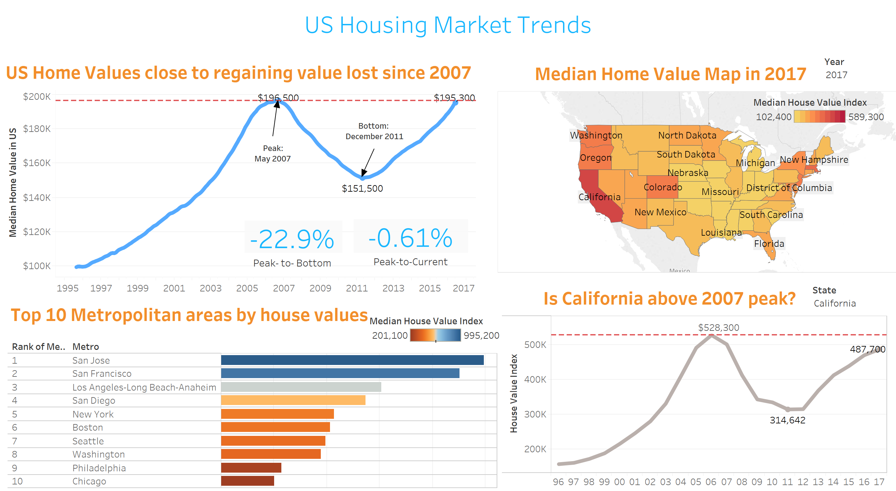

# U.S. Housing Market Trends Analysis using Tableau

## OBJECTIVE OF THE STUDY

The main goal of the project is to analyze the U.S. Housing Market Trends across different states and metropolitan areas for the 1996 – 2017 period using the rich capabilities of Tableau software to visualize the data and geo-mapping the data in particular, in order to be able to present the analysis in the most effective and easily comprehensible way. 

## PROJECT TOPIC

The U.S. Housing Market has been a hot topic of research and discussions among scientists, economists and the general public, especially since the infamous housing bubble collapse in 2008 caused by the subprime mortgage industry collapse and subsequent economic recession. 
The analysis will provide an overview of the current situation of national and local real estate and rental markets as well as analysis of the U.S. Housing Market Trends from 1996 to 2017. A particular attention in the analysis will be paid to the California and Los Angeles County real estate markets.  

## DATASET

Even though there are a multitude of sources that track and compile the real estate market information and statistics, for this project we have chosen to use the data sets provided by Zillow Real Estate Research given the vast amount and breadth of high quality data provided by them on the subject.

### Dataset links:
https://www.zillow.com/research/data/#median-home-value

https://www.zillow.com/research/data/#rental-data

